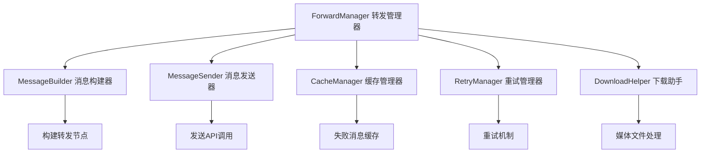

# 🔀 转发功能 API

欢迎查看麦咪的转发功能核心API文档喵♡～ 这里详细介绍了插件如何实现消息转发的所有功能！

## 🎯 核心组件架构

转发功能由多个专门的组件协作完成，每个组件都有其特定的职责喵～



## 🚀 ForwardManager 核心管理器

### 初始化

```python
class ForwardManager:
    def __init__(self, plugin):
        """
        初始化转发管理器喵！
        
        Args:
            plugin: 插件实例，提供各种配置和服务喵～
        """
        self.plugin = plugin
        self.image_dir = os.path.join(self.plugin.data_dir, "temp")
        
        # 初始化子组件
        self.download_helper = DownloadHelper(self.image_dir)
        self.message_builder = MessageBuilder(self.download_helper, self.plugin)
        self.cache_manager = CacheManager(plugin)
        self.message_sender = MessageSender(plugin, self.download_helper)
        self.retry_manager = RetryManager(...)
        
        # 防重复转发机制
        self._currently_forwarding = set()
        self._processing_forwards = set()
```

### 主要方法

#### `forward_messages(task_id: str, session_id: str)`

转发消息的核心方法喵～

```python
async def forward_messages(self, task_id: str, session_id: str):
    """
    转发消息到目标会话喵～ 📬
    这是主要的转发逻辑，会处理所有的转发流程！
    
    Args:
        task_id: 任务ID喵
        session_id: 会话ID喵
    
    处理流程：
    1. 🔐 防重复检查
    2. 🔍 获取任务和目标信息
    3. 📊 检查消息阈值
    4. 🏗️ 构建转发节点
    5. 📤 发送到各个目标
    6. 🧹 清理缓存
    """
```

**防重复机制**:
- 函数级别锁定：防止相同参数的并发调用
- 内容哈希检查：基于消息内容生成唯一标识
- 批次ID追踪：防止相同内容重复发送

#### `build_forward_node(msg_data: dict) -> dict`

构建单个转发节点喵～

```python
async def build_forward_node(self, msg_data: dict) -> dict:
    """
    构建单个转发节点喵～ 🏗️
    委托给MessageBuilder处理具体的构建逻辑！
    
    Args:
        msg_data: 消息数据字典
        
    Returns:
        构建好的转发节点字典
    """
```

#### 发送方法

```python
async def send_forward_message_via_api(self, target_session: str, nodes_list: list[dict]) -> bool:
    """使用原生API发送转发消息喵～ 📡"""

async def send_with_fallback(self, target_session: str, nodes_list: list[dict]) -> bool:
    """使用备选方案发送消息喵～ 🔄"""

async def retry_failed_messages(self):
    """重试发送失败消息喵～ 🔄"""
```

## 🏗️ MessageBuilder 消息构建器

### 核心功能

负责将各种消息类型转换为OneBot标准的转发节点格式喵～

#### 节点构建

```python
async def build_forward_node(self, msg_data: dict) -> dict:
    """
    构建转发消息节点喵～ 🏗️
    
    Args:
        msg_data: 包含以下字段的消息数据
            - id: 消息ID
            - timestamp: 时间戳  
            - sender_name: 发送者名称
            - sender_id: 发送者ID
            - messages: 消息组件列表
            
    Returns:
        OneBot标准转发节点格式：
        {
            "type": "node",
            "data": {
                "name": "发送者名称",
                "uin": "发送者ID", 
                "content": [消息组件列表],
                "time": 时间戳
            }
        }
    """
```

#### 支持的消息组件处理

##### 1. 文本消息
```python
{
    "type": "text",
    "data": {"text": "消息内容"}
}
```

##### 2. 图片消息
```python
{
    "type": "image", 
    "data": {
        "file": "图片URL或本地路径",
        "url": "原始URL",
        "filename": "文件名"
    }
}
```

**图片处理流程**:
1. 🌐 URL验证和可访问性检查
2. 📥 图片下载到本地临时目录
3. 🔄 Base64编码处理（如果需要）
4. 🖼️ 文件格式验证

##### 3. 特殊表情 (MFace)
```python
{
    "type": "image",
    "data": {
        "file": "表情URL",
        "mface": true,
        "summary": "表情描述",
        "emoji_id": "表情ID",
        "package_id": "表情包ID"
    }
}
```

##### 4. 引用回复
```python
{
    "type": "reply",
    "data": {"id": "被引用的消息ID"}
}
```

##### 5. At消息
```python
{
    "type": "at", 
    "data": {"qq": "被@的QQ号"}
}
```

##### 6. 转发消息（嵌套）
```python
{
    "type": "forward",
    "data": {"id": "转发消息ID"}
}
```

**嵌套转发处理**:
- 保持原始转发ID，不重构节点内容
- 适配QQ新版本的显示机制
- 自动处理转发消息的递归结构

#### 辅助方法

```python
def build_footer_node(self, source_name: str, message_count: int) -> dict:
    """构建转发消息底部信息节点喵～"""

async def _process_component(self, comp_type: str, comp: dict, timestamp: int) -> dict:
    """处理单个消息组件喵～"""

async def _process_image_component(self, comp: dict) -> dict:
    """处理图片组件喵～"""
```

## 📤 MessageSender 消息发送器

### 发送策略

使用多级发送策略确保消息成功到达喵～

#### 发送流程

```python
async def send_forward_message_via_api(self, target_session: str, nodes_list: list[dict]) -> bool:
    """
    使用多级策略发送转发消息喵～ 🚀
    
    发送策略：
    1. 📤 图片预上传到OneBot缓存
    2. 🎯 调用send_group_forward_msg/send_private_forward_msg
    3. 🔄 失败时使用备选方案
    4. 🛡️ 自动去重机制
    """
```

#### 支持的API调用

1. **QQ平台转发API**
   ```python
   # 群聊转发
   await client.call_action("send_group_forward_msg", 
                           group_id=group_id, 
                           messages=nodes_list)
   
   # 私聊转发  
   await client.call_action("send_private_forward_msg",
                           user_id=user_id,
                           messages=nodes_list)
   ```

2. **图片上传API**
   ```python
   # 群聊图片上传
   await client.call_action("upload_group_image",
                           group_id=group_id,
                           file=local_path)
   
   # 私聊图片上传
   await client.call_action("upload_private_image", 
                           user_id=user_id,
                           file=local_path)
   ```

#### 备选发送方案

```python
async def send_with_fallback(self, target_session: str, nodes_list: list[dict]) -> bool:
    """
    备选发送方案喵～ 🔄
    
    当标准转发API失败时使用：
    1. 📝 单条发送模式
    2. 🎨 简化消息格式
    3. 🔗 保持消息关联性
    """
```

#### 去重机制

```python
def _add_sent_message(self, session_id: str, message_id: str):
    """添加已发送消息记录喵～"""
    
def _is_message_sent(self, session_id: str, message_id: str) -> bool:
    """检查消息是否已发送喵～"""
    
def _cleanup_expired_messages(self):
    """清理过期的发送记录喵～"""
```

#### 非QQ平台支持

```python
async def send_to_non_qq_platform(self, target_session: str, source_name: str, messages: list) -> bool:
    """
    向非QQ平台发送消息喵～ 📱
    
    支持的平台：
    - Telegram
    - Discord  
    - 微信
    - 其他AstrBot支持的平台
    
    处理方式：
    - 转换为平台兼容格式
    - 保持消息结构完整性
    """
```

## 💾 CacheManager 缓存管理器

### 失败消息缓存

管理发送失败的消息，支持后续重试喵～

```python
class CacheManager:
    def add_failed_message(self, target_session: str, task_id: str, session_id: str):
        """添加失败消息到缓存喵～"""
        
    def remove_failed_message(self, target_session: str, task_id: str, session_id: str):
        """从缓存中移除失败消息喵～"""
        
    def get_failed_messages(self) -> dict:
        """获取所有失败消息喵～"""
        
    def save_failed_messages_cache(self):
        """保存失败消息缓存到文件喵～"""
```

### 缓存数据结构

```python
failed_messages_cache = {
    "target_session_id": {
        "task_id_session_id": {
            "task_id": "任务ID", 
            "session_id": "会话ID",
            "target_session": "目标会话ID",
            "timestamp": 时间戳,
            "retry_count": 重试次数
        }
    }
}
```

## 🔄 RetryManager 重试管理器

### 重试机制

智能重试失败的消息发送操作喵～

```python
class RetryManager:
    async def retry_failed_messages(self):
        """
        重试发送失败消息喵～ 🔄
        
        重试策略：
        1. 📊 获取所有失败消息
        2. ⏰ 检查重试间隔
        3. 🚀 重新构建和发送
        4. 📈 更新重试计数
        5. 🧹 清理过期记录
        """
```

### 重试配置

- **重试间隔**: 1小时
- **最大重试次数**: 3次  
- **过期时间**: 24小时后自动清理
- **重试条件**: 非永久性错误

## 📥 DownloadHelper 下载助手

### 媒体文件处理

专门处理各种媒体文件的下载和转换喵～

```python
class DownloadHelper:
    async def download_image(self, url: str, headers: dict = None) -> str:
        """下载图片并返回本地路径喵～ 🖼️"""
        
    async def get_image_base64(self, image_path: str) -> str:
        """获取图片的Base64编码喵～ 📊"""
        
    def cleanup_old_files(self, max_age_hours: int = 24):
        """清理过期的临时文件喵～ 🧹"""
```

### 支持的文件类型

- **图片**: JPG, PNG, GIF, WebP
- **音频**: MP3, WAV, AAC, OGG  
- **视频**: MP4, AVI, MOV
- **文档**: PDF, DOC, TXT

### 下载特性

- 🔄 自动重试机制
- 📊 进度跟踪
- 🛡️ 安全性验证
- 🧹 自动清理过期文件

## 🚨 错误处理和重试

### 错误分类

1. **网络错误**: 连接超时、DNS解析失败
2. **权限错误**: API权限不足、群聊踢出
3. **格式错误**: 消息格式不正确、文件损坏
4. **平台限制**: 频率限制、内容审核

### 处理策略

```python
# 可重试错误
RETRYABLE_ERRORS = [
    "网络连接超时",
    "服务器响应异常", 
    "临时权限不足"
]

# 永久性错误（不重试）
PERMANENT_ERRORS = [
    "机器人被踢出群聊",
    "用户不存在",
    "消息内容违规"
]
```

### 日志记录

```python
# 详细的错误日志
logger.error(f"转发消息到 {target_session} 失败: {error_message}")
logger.debug(f"节点数据: {nodes_list}")  
logger.info(f"重试第 {retry_count} 次")
```

## 📊 性能监控

### 关键指标

- **转发成功率**: 成功/总数
- **平均延迟**: 从接收到发送完成的时间
- **重试率**: 需要重试的消息比例
- **缓存命中率**: 图片缓存使用效率

### 性能优化

1. **批量处理**: 多条消息合并转发
2. **缓存复用**: 相同图片只下载一次
3. **异步处理**: 并行处理多个目标
4. **智能清理**: 定期清理过期数据

## 🔍 调试工具

### 详细日志

```python
# 开启详细日志模式
logger.setLevel(logging.DEBUG)

# 关键节点日志
logger.debug(f"构建转发节点: {node_data}")
logger.info(f"发送成功: {target_session}")
logger.warning(f"重试发送: {retry_count}/3")
```

### 状态检查命令

```bash
# 查看转发状态
/turnrig status

# 手动触发转发  
/turnrig forward 任务ID

# 清理失败缓存
/turnrig cleanup
```

## 📚 使用示例

### 基础转发

```python
# 触发消息转发
await forward_manager.forward_messages("task_1", "aiocqhttp:GroupMessage:123456")
```

### 手动构建节点

```python
# 构建自定义转发节点
msg_data = {
    "id": "msg_123",
    "timestamp": int(time.time()),
    "sender_name": "用户名",
    "sender_id": "123456",
    "messages": [{"type": "plain", "text": "消息内容"}]
}

node = await message_builder.build_forward_node(msg_data)
```

### 批量发送

```python
# 向多个目标发送
target_sessions = [
    "aiocqhttp:GroupMessage:111111",
    "aiocqhttp:GroupMessage:222222"
]

for target in target_sessions:
    success = await message_sender.send_forward_message_via_api(target, nodes_list)
    if not success:
        cache_manager.add_failed_message(target, task_id, session_id)
```

---

这套转发API为麦咪提供了强大而可靠的消息转发能力，支持多平台、多格式、高可用性的消息传递喵♡～ ✨

如需了解消息处理的API，请查看 [消息处理 API](message-handling.md) 文档！ 