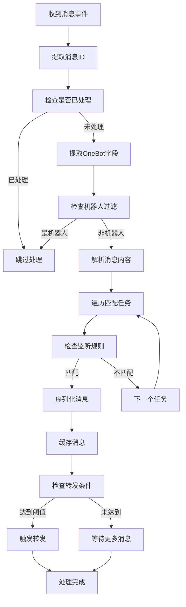

# 📨 消息处理 API

欢迎查看麦咪的消息处理核心API文档喵♡～ 这里详细介绍了插件如何处理各种消息类型！

## 🎯 核心组件

### MessageListener 类

消息监听器是处理所有消息事件的核心组件喵～

#### 初始化

```python
class MessageListener:
    def __init__(self, plugin):
        """
        初始化消息监听器喵～ 🐾
        
        Args:
            plugin: 插件实例，提供配置和服务喵～
        """
        self.plugin = plugin
        self.message_count = 0  # 调试计数器喵～
```

#### 核心方法

##### `on_all_message(event: AstrMessageEvent)`

处理所有消息事件的主要方法喵～

```python
async def on_all_message(self, event: AstrMessageEvent):
    """
    监听所有消息并进行处理喵～ 👂
    这是消息处理的核心方法，会对每条消息进行详细分析！
    
    Args:
        event: 消息事件对象喵
        
    Note:
        会自动过滤重复消息和插件指令喵～ 🔍
    """
```

**处理流程**:
1. 🆔 消息ID获取和去重检查
2. 🔍 OneBot V11协议字段提取
3. 🤖 机器人消息过滤（防止循环）
4. 📝 消息内容解析和序列化
5. 🎯 任务匹配和缓存处理
6. 📤 转发条件检查和触发

##### `on_group_upload_notice(event)`

处理群文件上传通知喵～

```python
async def on_group_upload_notice(self, event):
    """
    处理群文件上传通知喵～ 📁
    
    Args:
        event: 通知事件对象喵
    """
```

**支持的文件信息**:
- `name`: 文件名称
- `size`: 文件大小
- `url`: 下载链接
- `busid`: 业务ID
- `id`: 文件ID

#### 辅助方法

##### 消息过滤

```python
def _is_message_processed(self, message_id: str) -> bool:
    """检查消息是否已经被处理过喵～"""

def _mark_message_processed(self, message_id: str, task_id: str):
    """标记消息为已处理喵～"""
```

##### OneBot字段提取

```python
def _extract_onebot_fields(self, event: AstrMessageEvent) -> dict:
    """
    从 aiocqhttp_platform_adapter 的原始事件中提取 OneBot V11 协议字段喵～
    
    Returns:
        包含 message_type, sub_type 等原始字段的字典喵～
    """
```

**返回字段**:
- `message_type`: 消息类型（private/group）
- `sub_type`: 子类型（normal/anonymous等）
- `platform`: 平台名称

##### 监听规则检查

```python
def _should_monitor_message(self, task, event) -> bool:
    """检查是否应该监听此消息（基于会话）喵～"""

def _should_monitor_user(self, task, event) -> bool:
    """检查是否应该监听此用户（私聊用户）喵～"""

def _should_monitor_group_user(self, task, event) -> bool:
    """检查是否应该监听群内特定用户喵～"""
```

## 🔧 消息序列化 API

### MessageSerializer 模块

负责将AstrBot消息组件转换为可存储的JSON格式喵～

#### 同步序列化

```python
def serialize_message(message: list[BaseMessageComponent]) -> list[dict[str, Any]]:
    """
    同步序列化消息组件喵～ 📦
    
    Args:
        message: AstrBot消息组件列表喵
        
    Returns:
        序列化后的字典列表喵
    """
```

#### 异步序列化

```python
async def async_serialize_message(message: list[BaseMessageComponent], event: AstrMessageEvent) -> list[dict[str, Any]]:
    """
    异步序列化消息组件，支持复杂的网络操作喵～ 🌐
    
    Args:
        message: AstrBot消息组件列表喵
        event: 消息事件对象（用于获取额外信息）喵
        
    Returns:
        序列化后的字典列表喵
    """
```

#### 支持的消息类型

##### 1. 纯文本消息
```python
{
    "type": "plain",
    "text": "消息内容"
}
```

##### 2. 图片消息
```python
{
    "type": "image",
    "url": "图片URL",
    "filename": "文件名.jpg",
    "base64": "base64数据"  # 可选
}
```

##### 3. 特殊表情 (MFace)
```python
{
    "type": "image",
    "url": "表情URL",
    "summary": "[表情描述]",
    "emoji_id": "表情ID",
    "emoji_package_id": "表情包ID",
    "key": "表情键值",
    "is_mface": true,
    "is_gif": true,
    "flash": true
}
```

##### 4. 引用回复
```python
{
    "type": "reply",
    "message_id": "被引用的消息ID"
}
```

##### 5. 转发消息
```python
{
    "type": "forward",
    "data": {
        "id": "转发消息ID"
    }
}
```

##### 6. At消息
```python
{
    "type": "at",
    "qq": "被@的QQ号"
}
```

##### 7. 群文件上传通知
```python
{
    "type": "notice",
    "notice_type": "group_upload",
    "file": {
        "name": "文件名",
        "size": 文件大小,
        "url": "下载链接",
        "busid": "业务ID",
        "id": "文件ID"
    }
}
```

## 📊 消息缓存 API

### 缓存结构

```python
message_cache = {
    "任务ID": {
        "会话ID": [
            {
                "id": "消息ID",
                "timestamp": 时间戳,
                "sender_name": "发送者名称",
                "sender_id": "发送者ID",
                "messages": [序列化消息组件],
                "message_outline": "消息概要",
                "onebot_fields": {
                    "message_type": "消息类型",
                    "sub_type": "子类型",
                    "platform": "平台名称"
                }
            }
        ]
    }
}
```

### 智能缓存清理

```python
def _smart_cache_cleanup(self, task_id: str, session_id: str, max_messages: int):
    """
    智能缓存清理策略喵～ 🧠✨
    
    - 当缓存达到阈值时自动清理
    - 保留最新的消息
    - 优化内存使用
    """
```

## 🚀 事件处理流程

### 消息处理管道



## ⚠️ 错误处理

### 异常类型

1. **消息ID获取失败**
   - 自动生成临时ID
   - 记录警告日志

2. **OneBot字段提取失败**
   - 使用默认值
   - 继续处理流程

3. **消息序列化失败**
   - 降级为纯文本处理
   - 保存原始内容

4. **缓存操作失败**
   - 记录错误日志
   - 不影响其他消息处理

### 日志级别

- `DEBUG`: 详细的处理流程信息
- `INFO`: 重要的处理结果
- `WARNING`: 非致命的问题
- `ERROR`: 严重错误，但不中断处理

## 🔍 调试工具

### 消息计数器

```python
self.message_count += 1  # 跟踪处理的消息数量
```

### 详细日志

```python
logger.debug(f"收到消息 [{event.get_sender_name()}]: \"{plain_text}\" (长度: {len(plain_text)}) 喵～ 📩")
logger.info(f"已缓存消息到任务 {task_id}, 会话 {session_id}, 缓存大小: {len(cache)} 📊")
```

### 原始数据访问

```python
# 访问原始消息对象
raw_message = event.message_obj.raw_message

# 查看所有属性（调试用）
for attr_name in dir(event.message_obj):
    if not attr_name.startswith("_"):
        attr_value = getattr(event.message_obj, attr_name)
```

## 📚 使用示例

### 基础消息监听

```python
# 在插件中注册消息监听器
@filter.event_message_type(filter.EventMessageType.ALL)
@filter.platform_adapter_type(filter.PlatformAdapterType.AIOCQHTTP)
async def on_all_message(self, event: AstrMessageEvent):
    # 委托给消息监听器处理
    await self.message_listener.on_all_message(event)
```

### 自定义消息过滤

```python
# 检查消息是否匹配特定条件
if self._should_monitor_message(task, event):
    # 处理符合条件的消息
    await self._process_message(event, task)
```

### 消息序列化处理

```python
# 序列化消息组件
messages = event.get_messages()
serialized = await async_serialize_message(messages, event)

# 保存到缓存
cached_message = {
    "id": message_id,
    "timestamp": int(time.time()),
    "messages": serialized,
    # ... 其他字段
}
```

---

这套API为麦咪的消息处理提供了完整的支持，涵盖了从消息接收到缓存处理的全流程喵♡～ ✨

如需了解转发功能的API，请查看 [转发功能 API](forwarding.md) 文档！ 