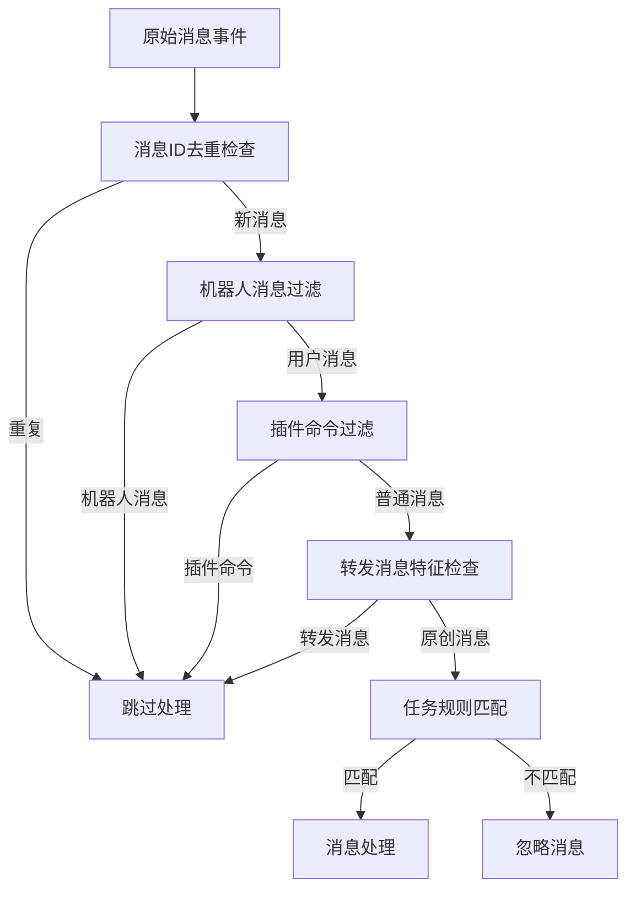
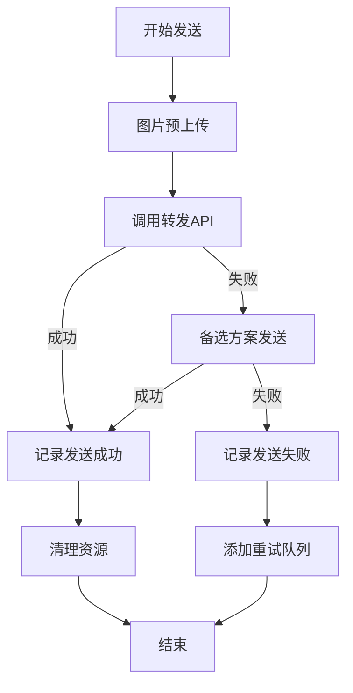
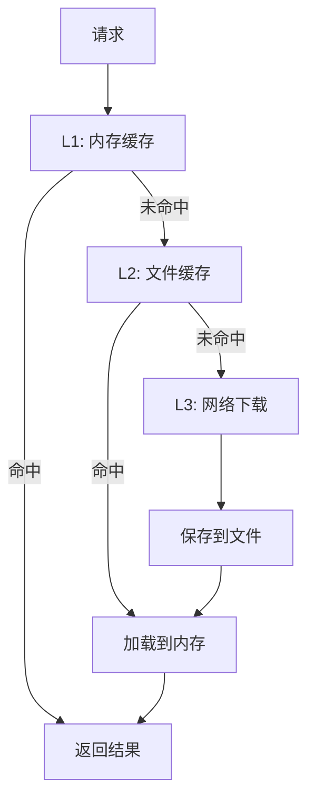

# 🧩 组件设计

欢迎查看 **Turnrign** 插件的详细组件设计文档 这里深入介绍每个组件的设计思想和实现细节！

## 🎮 Main Plugin (主插件)

### 设计概述

主插件是整个系统的入口点和协调中心，负责管理所有子组件的生命周期喵～

```python
class TurnrigPlugin:
    """
    turnrig 插件主类
    
    职责：
    - 插件生命周期管理
    - 组件初始化和协调
    - 配置管理
    - 事件分发
    """
    
    def __init__(self):
        self.data_dir = None              # 数据目录
        self.config = {}                  # 配置信息
        self.message_cache = {}           # 消息缓存
        self.context = None               # AstrBot上下文
        
        # 核心组件
        self.message_listener = None      # 消息监听器
        self.forward_manager = None       # 转发管理器
        self.command_handlers = None      # 命令处理器
```

### 核心职责

#### 1. 插件生命周期管理

```python
async def initialize(self):
    """
    插件初始化
    
    初始化顺序：
    1. 创建数据目录
    2. 加载配置文件
    3. 初始化各个组件
    4. 注册事件监听器
    """
    
async def destroy(self):
    """
    插件销毁
    
    清理顺序：
    1. 保存缓存数据
    2. 停止后台任务
    3. 释放资源
    """
```

#### 2. 配置管理

```python
def load_config(self):
    """加载配置文件"""
    
def save_config(self):
    """保存配置文件"""
    
def validate_config(self, config: dict) -> bool:
    """验证配置有效性"""
```

#### 3. 组件协调

```python
def get_all_enabled_tasks(self) -> list:
    """获取所有启用的任务"""
    
def get_task_by_id(self, task_id: str) -> dict:
    """根据ID获取任务配置"""
```

## 👂 Message Listener (消息监听器)

### 设计概述

消息监听器是系统的感知器官，负责监听所有消息事件并进行预处理

```python
class MessageListener:
    """
    消息监听器
    
    职责：
    - 监听所有消息事件
    - 消息预处理和过滤
    - 消息序列化
    - 缓存管理
    """
    
    def __init__(self, plugin):
        self.plugin = plugin
        self.message_count = 0  # 调试计数器
```

### 核心功能设计

#### 1. 多层过滤机制

> [!TIP]
> 该图可能是不准确的。



#### 2. 消息序列化策略

```python
async def on_all_message(self, event: AstrMessageEvent):
    """
    消息处理主流程
    
    处理步骤：
    1. 消息ID提取和去重
    2. OneBot字段提取
    3. 消息内容解析
    4. 任务规则匹配
    5. 消息序列化
    6. 缓存存储
    7. 转发触发
    """
```

#### 3. 特殊消息处理

```python
def _extract_onebot_fields(self, event: AstrMessageEvent) -> dict:
    """
    OneBot协议字段提取
    
    提取字段：
    - message_type: 消息类型
    - sub_type: 子类型
    - platform: 平台名称
    """

async def on_group_upload_notice(self, event):
    """
    群文件上传通知处理
    
    处理文件信息：
    - name: 文件名
    - size: 文件大小
    - url: 下载链接
    """
```

## 📤 Forward Manager (转发管理器)

### 设计概述

转发管理器是系统的大脑，负责协调所有转发相关的操作

```python
class ForwardManager:
    """
    转发管理器
    
    职责：
    - 转发逻辑协调
    - 组件管理
    - 防重复机制
    - 重试策略
    """
    
    def __init__(self, plugin):
        self.plugin = plugin
        
        # 子组件初始化
        self.download_helper = DownloadHelper(self.image_dir)
        self.message_builder = MessageBuilder(...)
        self.message_sender = MessageSender(...)
        self.cache_manager = CacheManager(...)
        self.retry_manager = RetryManager(...)
        
        # 防重复机制
        self._currently_forwarding = set()
        self._processing_forwards = set()
```

### 核心算法设计

#### 1. 防重复转发机制

```python
async def forward_messages(self, task_id: str, session_id: str):
    """
    转发消息核心算法
    
    防重复策略：
    1. 函数级别锁定：防止相同参数的并发调用
    2. 内容哈希检查：基于消息内容生成唯一标识
    3. 批次ID追踪：防止相同内容重复发送
    """
    
    # 生成函数级别锁定键
    function_key = f"forward_{task_id}_{session_id}"
    
    # 生成内容哈希
    message_batch_content = str([msg.get("message_outline", "") for msg in valid_messages])
    batch_hash = hashlib.md5(message_batch_content.encode()).hexdigest()[:8]
    
    # 生成转发键
    forwarding_key = f"{task_id}_{session_id}_{batch_hash}"
```

#### 2. 阈值检查算法

```python
def check_forward_threshold(self, task: dict, messages: list) -> bool:
    """
    检查是否达到转发阈值
    
    检查逻辑：
    1. 过滤有效消息
    2. 对比消息数量与阈值
    3. 返回是否触发转发
    """
    
    valid_messages = [msg for msg in messages if msg.get("messages")]
    max_messages = task.get("max_messages", self.plugin.config.get("default_max_messages", 20))
    
    return len(valid_messages) >= max_messages
```

## 🏗️ Message Builder (消息构建器)

### 设计概述

消息构建器负责将接收到的消息转换为适合转发的格式

```python
class MessageBuilder:
    """
    消息构建器
    
    职责：
    - 消息格式转换
    - 转发节点构建
    - 媒体文件处理
    - 特殊消息处理
    """
```

### 构建策略设计

#### 1. 节点构建算法

```python
async def build_forward_node(self, msg_data: dict) -> dict:
    """
    构建转发节点
    
    构建流程：
    1. 提取基础信息（发送者、时间等）
    2. 处理消息组件列表
    3. 构建OneBot标准节点格式
    4. 添加时间戳和元数据
    """
    
    return {
        "type": "node",
        "data": {
            "name": msg_data.get("sender_name", "未知用户"),
            "uin": str(msg_data.get("sender_id", "0")),
            "content": processed_content,
            "time": msg_data.get("timestamp", int(time.time()))
        }
    }
```

#### 2. 组件处理策略

```python
async def _process_component(self, comp_type: str, comp: dict, timestamp: int) -> dict:
    """
    组件处理调度器
    
    支持的组件类型：
    - plain: 纯文本
    - image: 图片
    - reply: 引用回复
    - at: @消息
    - forward: 转发消息
    - face: 表情
    - unknown: 未知类型
    """
    
    processors = {
        "plain": self._process_plain_component,
        "image": self._process_image_component,
        "reply": self._process_reply_component,
        # ... 其他处理器
    }
    
    processor = processors.get(comp_type, self._process_unknown_component)
    return await processor(comp, timestamp)
```

#### 3. 图片处理算法

```python
async def _process_image_component(self, comp: dict) -> dict:
    """
    图片组件处理
    
    处理策略：
    1. 检查是否为特殊表情(MFace)
    2. URL有效性验证
    3. 图片下载和缓存
    4. Base64编码处理
    5. 构建图片消息格式
    """
    
    # 特殊表情处理
    if comp.get("is_mface", False):
        return self._build_mface_component(comp)
    
    # 普通图片处理
    return await self._build_image_component(comp)
```

## 📡 Message Sender (消息发送器)

### 设计概述

消息发送器负责将构建好的消息发送到各个目标平台

```python
class MessageSender:
    """
    消息发送器
    
    职责：
    - 多平台消息发送
    - API调用管理
    - 重试机制
    - 去重处理
    """
    
    def __init__(self, plugin, download_helper):
        self.plugin = plugin
        self.download_helper = download_helper
        
        # 消息追踪
        self._message_tracking_lock = threading.RLock()
        self._sent_message_ids = defaultdict(set)
        self._message_timestamps = {}
```

### 发送策略设计

#### 1. 多级发送策略

> [!TIP]
> 该图可能是不准确的。



#### 2. 平台适配策略

```python
async def send_forward_message_via_api(self, target_session: str, nodes_list: list[dict]) -> bool:
    """
    API发送策略
    
    发送流程：
    1. 解析目标会话信息
    2. 检查平台适配器
    3. 预处理图片资源
    4. 调用对应平台API
    5. 处理响应结果
    """
    
    # 解析目标信息
    target_platform, target_type, target_id = target_session.split(":", 2)
    
    # 平台特定处理
    if target_platform == "aiocqhttp":
        return await self._send_qq_forward(target_type, target_id, nodes_list)
    else:
        return await self.send_to_non_qq_platform(target_session, source_name, messages)
```

#### 3. 去重机制设计

```python
def _add_sent_message(self, session_id: str, message_id: str):
    """
    添加已发送消息记录
    
    记录策略：
    1. 使用线程安全的锁机制
    2. 按会话ID分组存储
    3. 记录消息时间戳
    4. 定期清理过期记录
    """
    
def _is_message_sent(self, session_id: str, message_id: str) -> bool:
    """检查消息是否已发送"""
    
def _cleanup_expired_messages(self):
    """清理过期消息记录"""
```

## 💾 Cache Manager (缓存管理器)

### 设计概述

缓存管理器负责管理各种缓存数据，确保数据的一致性和可靠性喵～

```python
class CacheManager:
    """
    缓存管理器
    
    职责：
    - 失败消息缓存
    - 数据持久化
    - 缓存清理
    - 数据一致性
    """
```

### 缓存策略设计

#### 1. 失败消息缓存结构

```python
# 缓存数据结构
failed_messages_cache = {
    "target_session_id": {
        "task_id_session_id": {
            "task_id": "任务ID",
            "session_id": "会话ID", 
            "target_session": "目标会话ID",
            "timestamp": 时间戳,
            "retry_count": 重试次数
        }
    }
}
```

#### 2. 缓存操作算法

```python
def add_failed_message(self, target_session: str, task_id: str, session_id: str):
    """
    添加失败消息
    
    添加策略：
    1. 生成唯一键
    2. 检查是否已存在
    3. 更新重试计数
    4. 记录时间戳
    """
    
def remove_failed_message(self, target_session: str, task_id: str, session_id: str):
    """移除失败消息"""
    
def cleanup_expired_failed_messages(self):
    """清理过期失败消息"""
```

## 🔄 Retry Manager (重试管理器)

### 设计概述

重试管理器负责智能重试失败的操作，提高系统的可靠性

```python
class RetryManager:
    """
    重试管理器
    
    职责：
    - 失败消息重试
    - 重试策略执行
    - 重试计数管理
    - 过期消息清理
    """
```

### 重试策略设计

#### 1. 重试算法

```python
async def retry_failed_messages(self):
    """
    重试失败消息
    
    重试流程：
    1. 获取所有失败消息
    2. 过滤可重试消息
    3. 重新构建和发送
    4. 更新重试状态
    5. 清理过期消息
    """
    
    failed_messages = self.cache_manager.get_failed_messages()
    
    for target_session, sessions in failed_messages.items():
        for session_key, failed_msg in sessions.items():
            if self._should_retry(failed_msg):
                await self._retry_single_message(failed_msg)
```

#### 2. 重试条件判断

```python
def _should_retry(self, failed_msg: dict) -> bool:
    """
    判断是否应该重试
    
    判断条件：
    1. 重试次数未超限
    2. 消息未过期
    3. 任务仍然存在
    4. 目标会话有效
    """
    
    MAX_RETRY_COUNT = 3
    MAX_AGE_HOURS = 24
    
    return (
        failed_msg.get("retry_count", 0) < MAX_RETRY_COUNT and
        self._is_message_fresh(failed_msg) and
        self._is_task_valid(failed_msg["task_id"])
    )
```

## 📥 Download Helper (下载助手)

### 设计概述

下载助手负责处理所有媒体文件的下载、缓存和转换操作

```python
class DownloadHelper:
    """
    下载助手
    
    职责：
    - 媒体文件下载
    - 文件格式转换
    - 缓存管理
    - 错误处理
    """
```

### 下载策略设计

#### 1. 智能下载算法

```python
async def download_image(self, url: str, headers: dict = None) -> str:
    """
    智能图片下载
    
    下载策略：
    1. URL有效性检查
    2. 缓存查找
    3. 并发下载控制
    4. 重试机制
    5. 文件验证
    """
    
    # 缓存检查
    cached_path = self._get_cached_file(url)
    if cached_path and os.path.exists(cached_path):
        return cached_path
    
    # 下载处理
    return await self._download_with_retry(url, headers)
```

#### 2. 文件管理策略

```python
def cleanup_old_files(self, max_age_hours: int = 24):
    """
    清理过期文件
    
    清理策略：
    1. 扫描临时目录
    2. 检查文件年龄
    3. 删除过期文件
    4. 更新缓存索引
    """
    
def get_file_info(self, file_path: str) -> dict:
    """获取文件信息"""
    
async def convert_image_format(self, input_path: str, target_format: str) -> str:
    """转换图片格式"""
```

## 🧠 智能缓存设计

### 多级缓存架构

> [!TIP]
> 该图可能是不准确的。



### 缓存清理策略

1. **时间驱动**: 定期清理过期数据
2. **空间驱动**: 达到空间限制时清理最久未使用的数据
3. **访问驱动**: 基于访问频率的智能清理

## 🔒 线程安全设计

### 锁机制策略

```python
class ThreadSafeComponent:
    """线程安全组件基类"""
    
    def __init__(self):
        self._lock = threading.RLock()  # 递归锁
        self._async_lock = asyncio.Lock()  # 异步锁
        
    async def async_operation(self):
        """异步操作喵～"""
        async with self._async_lock:
            # 异步操作逻辑
            pass
            
    def sync_operation(self):
        """同步操作喵～"""
        with self._lock:
            # 同步操作逻辑
            pass
```

### 数据一致性保证

1. **原子操作**: 关键操作使用原子性保证
2. **事务处理**: 复杂操作使用事务机制
3. **状态同步**: 组件间状态及时同步

---

这套组件设计为 **Turnrig** 插件提供了清晰的架构指导，每个组件都有明确的职责边界和良好的扩展性 ✨

如需了解数据在组件间的流转过程，请查看 [数据流图](message-flow.md) 文档！ 
