# 📊 数据流图

欢迎查看麦咪转发插件的详细数据流图文档喵♡～ 这里全面展示消息和数据在系统中的流转过程！

## 🌊 整体数据流概览

### 系统级数据流

> [!TIP]
> 这图可能是错的。

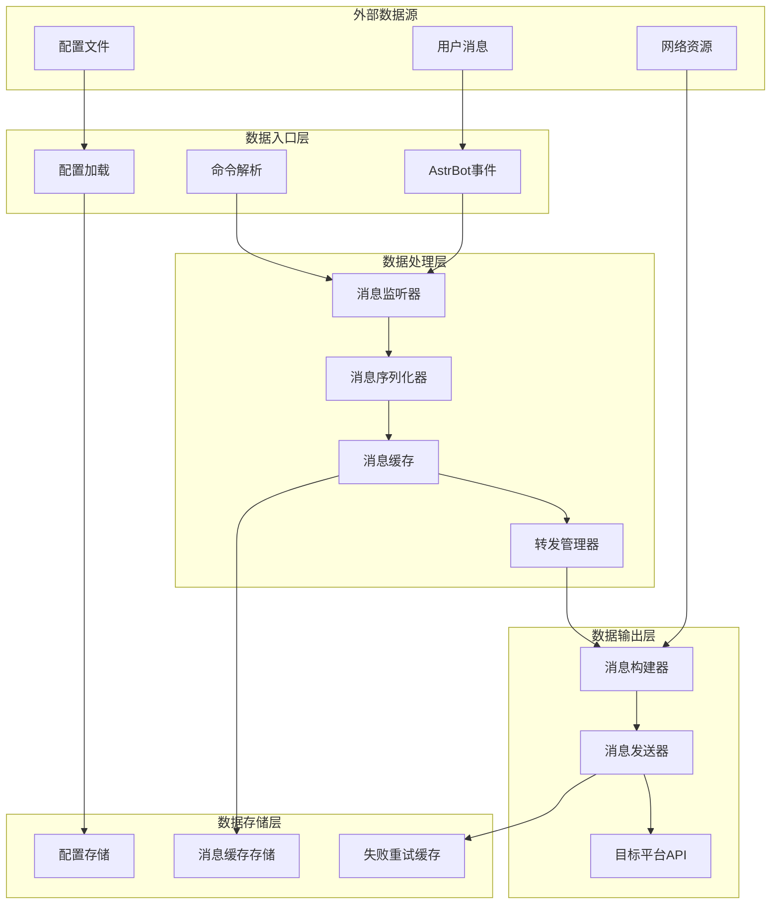

## 📨 消息处理数据流

### 完整消息处理时序图

> [!TIP]
> 这图可能是错的。

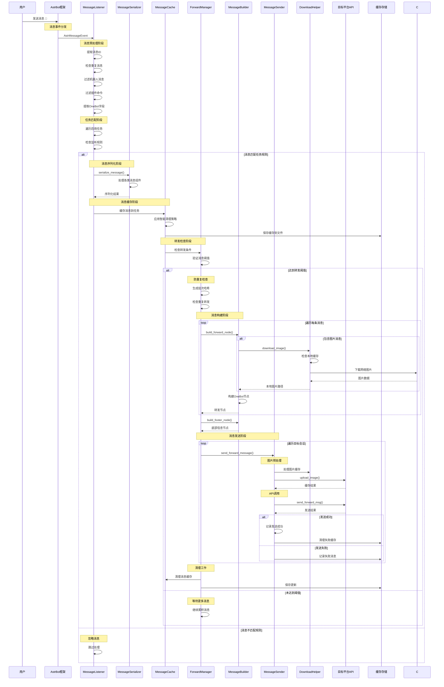

### 消息组件序列化流程

> [!TIP]
> 这图可能是错的。

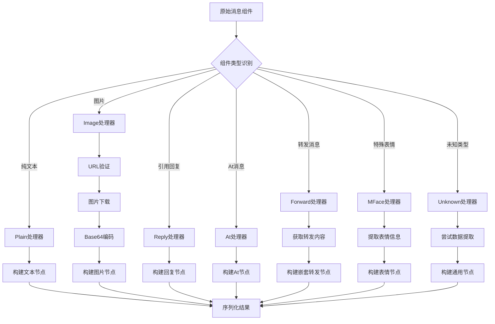

## 🔄 配置管理数据流

### 配置操作流程

> [!TIP]
> 这图可能是错的。

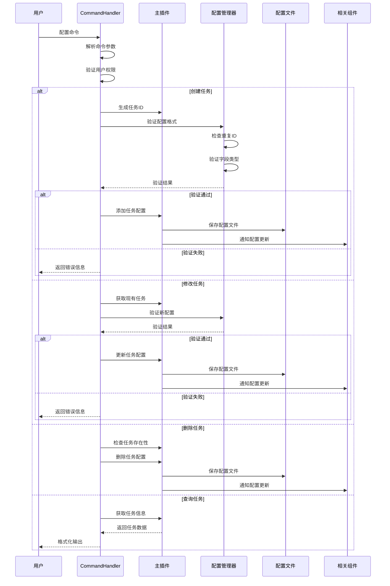

### 配置验证流程

> [!TIP]
> 这图可能是错的。

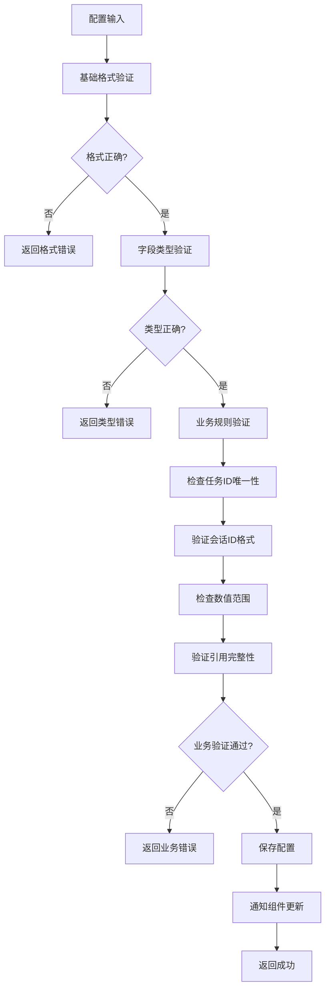

## 💾 缓存数据流

### 消息缓存流程

> [!TIP]
> 这图可能是错的。

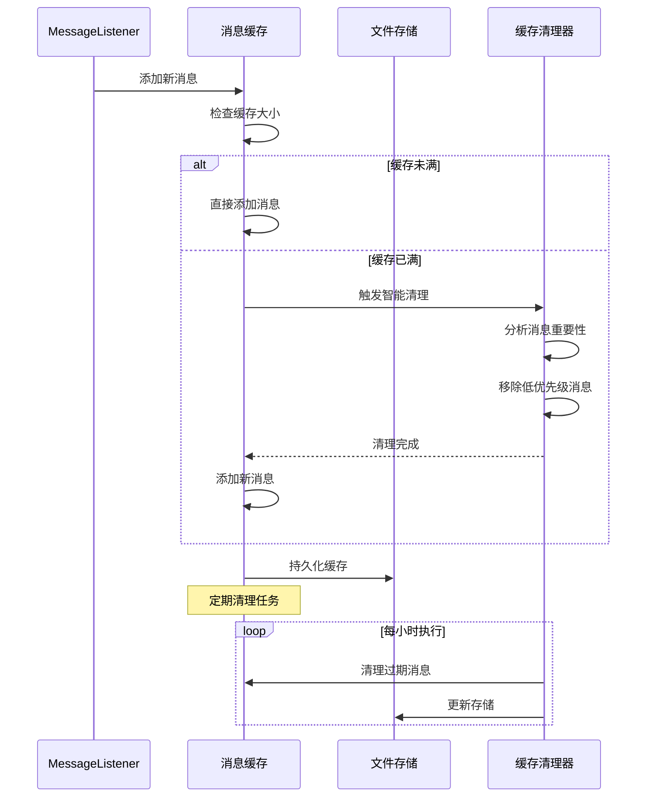

### 失败重试缓存流程

> [!TIP]
> 这图可能是错的。

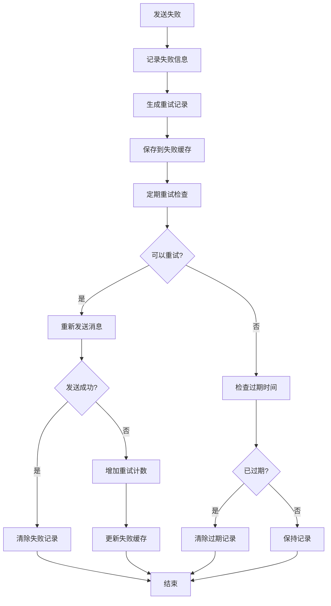

## 🔄 并发数据流

### 多任务并发处理

> [!TIP]
> 这图可能是错的。

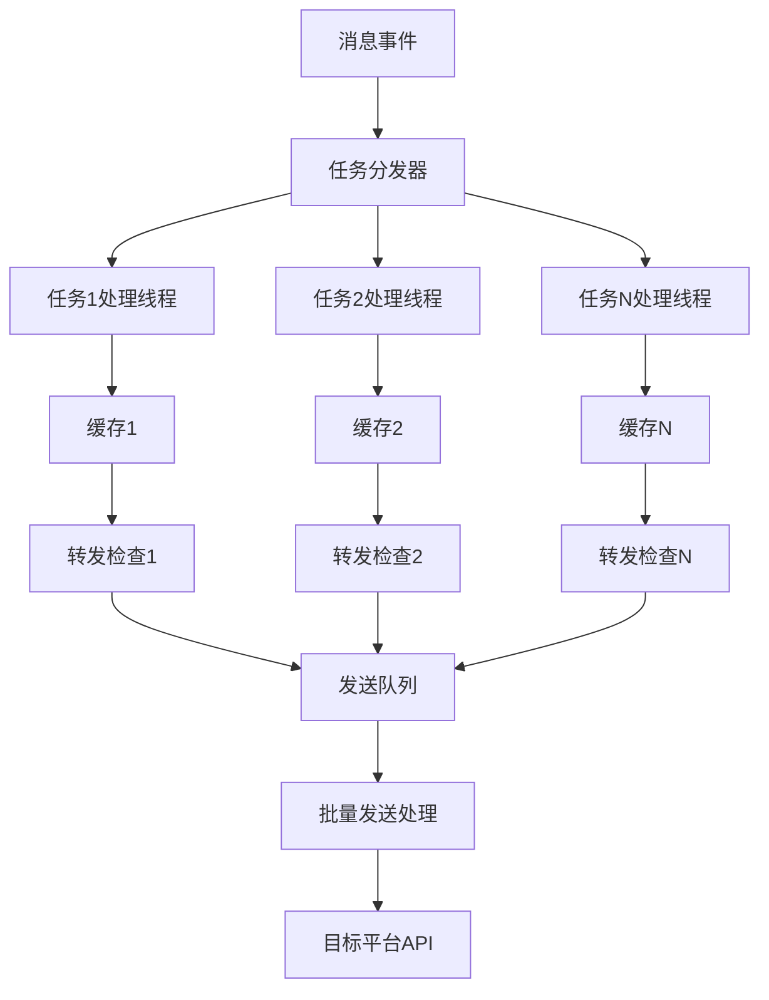

### 消息发送并发流程

> [!TIP]
> 这图可能是错的。

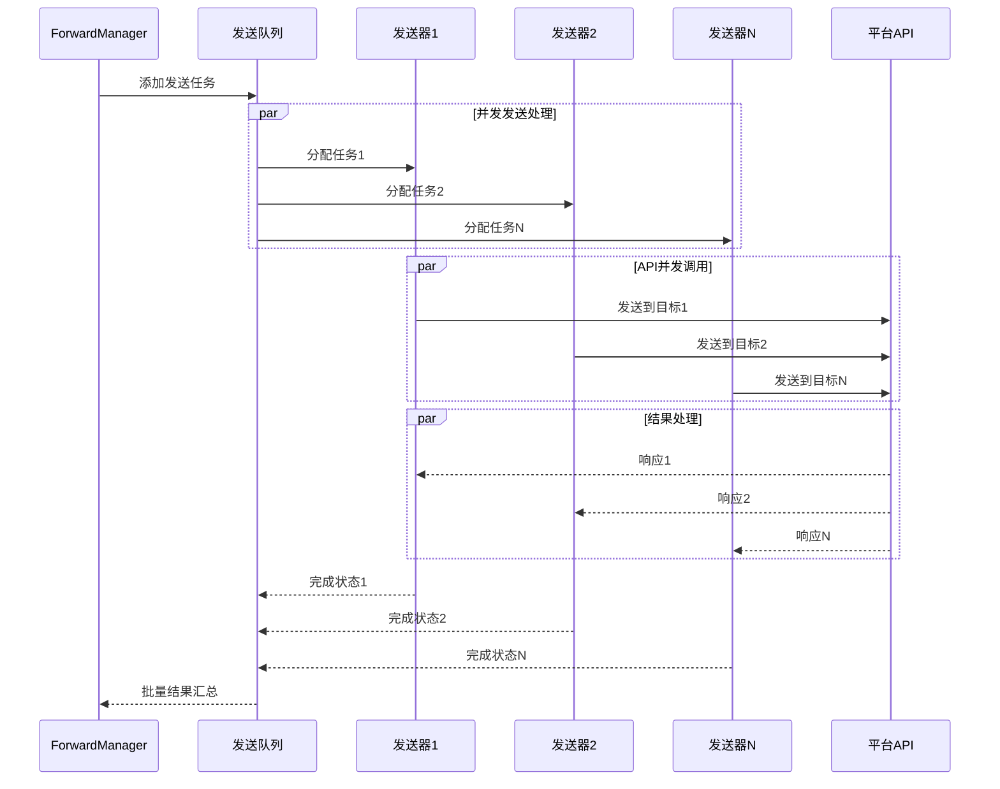

## 🛡️ 错误处理数据流

### 异常处理流程

> [!TIP]
> 这图可能是错的。

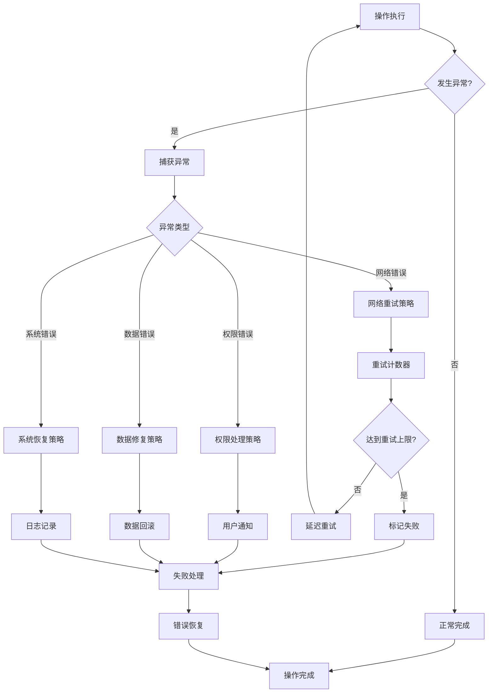

### 数据一致性保证流程

> [!TIP]
> 这图可能是错的。

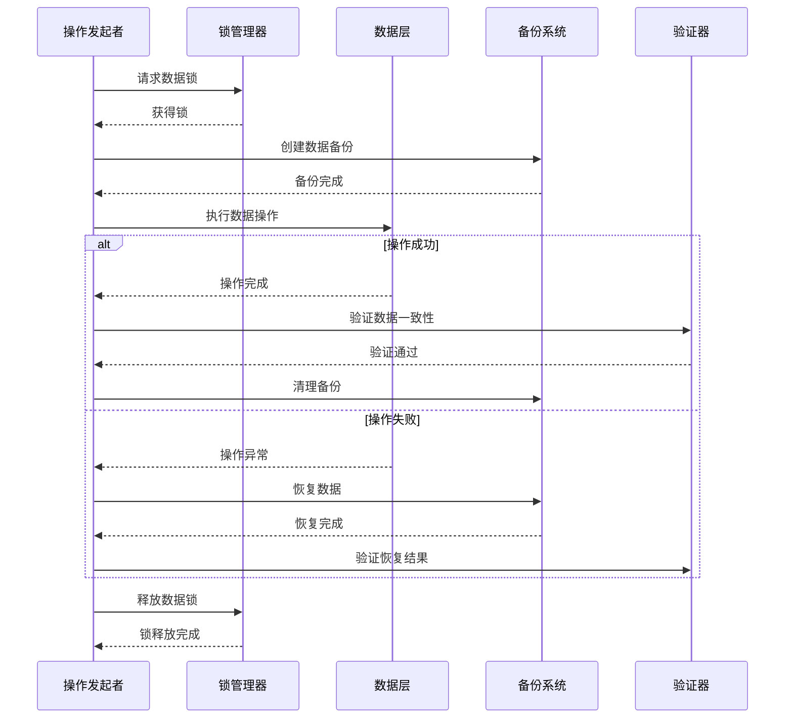

## 📊 性能监控数据流

### 指标收集流程

> [!TIP]
> 这图可能是错的。

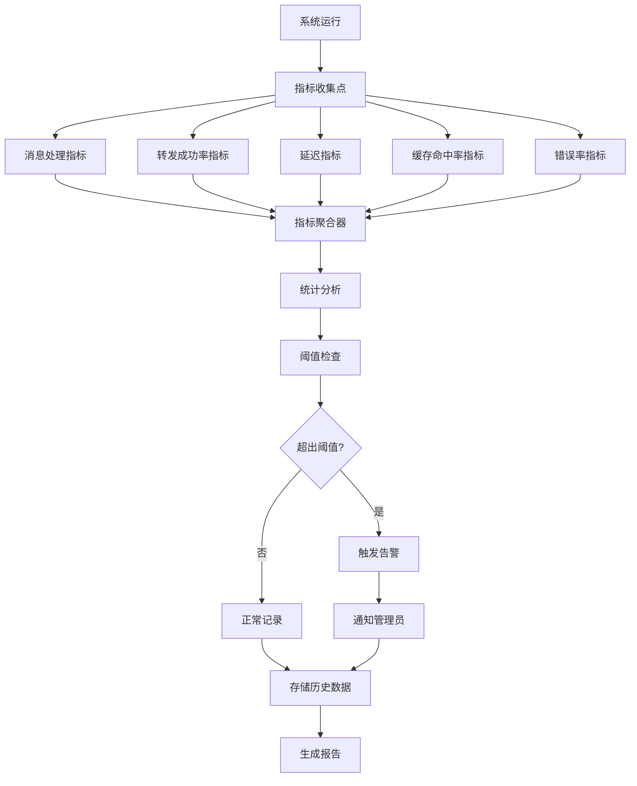

## 🔧 调试数据流

### 调试信息流程

> [!TIP]
> 这图可能是错的。

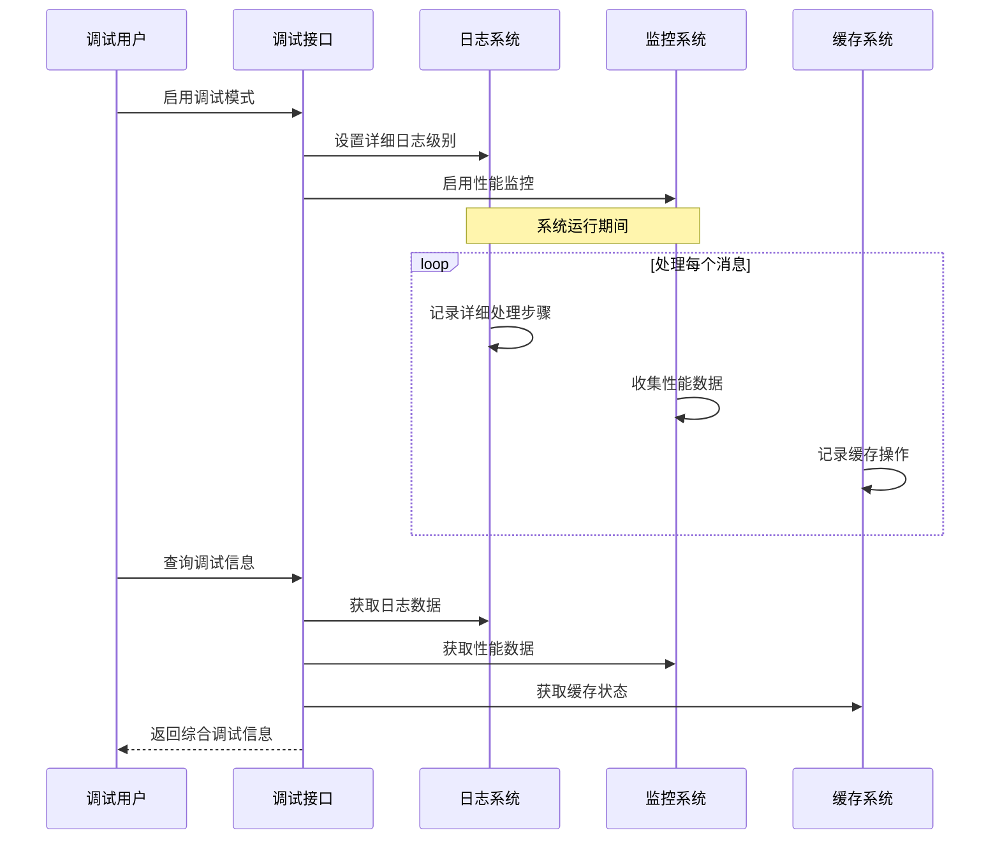

---

这套完整的数据流图展现了麦咪转发插件中数据的精确流转过程，为系统优化和问题排查提供了清晰的指导喵♡～ ✨

配合 [设计概览](overview.md) 和 [组件设计](component-design.md) 文档，可以全面理解插件的工作原理！ 