# 🎯 设计概览

欢迎了解 **Turnrig** 插件的整体设计理念和架构思想 这里会带你深入理解插件的核心设计！

## 🌟 设计理念

### 核心目标

**Turnrig** 插件旨在为 `AstrBot` 提供强大而灵活的消息转发能力，让不同会话之间的消息能够自由流动

1. **🔄 智能转发**: 基于规则自动转发消息，支持多种监听和转发模式
2. **🛡️ 稳定可靠**: 具备完善的错误处理和重试机制
3. **⚡ 高性能**: 优化的异步处理和缓存策略
4. **🎨 易用性**: 简洁直观的配置和管理界面
5. **🔧 可扩展**: 模块化设计，支持功能扩展

### 设计原则

#### 1. 模块化设计 🧩
- 每个功能模块职责单一，相互解耦
- 便于测试、维护和功能扩展
- 支持插件式功能增强

#### 2. 异步优先 ⚡
- 全异步事件处理，避免阻塞
- 并发处理多个转发任务
- 优化系统响应性能

#### 3. 容错设计 🛡️
- 多层错误处理机制
- 自动重试和降级策略
- 优雅的故障恢复

#### 4. 数据驱动 📊
- 基于配置文件的规则定义
- 运行时配置热加载
- 数据与逻辑分离

## 🏗️ 整体架构

### 系统架构图

> [!TIP]
> 该图可能是不准确的。



```mermaid
graph TB
    subgraph "AstrBot 框架层"
        A[AstrBot Core] --> B[消息事件分发]
        B --> C[Plugin Loader]
    end
    
    subgraph "麦咪转发插件"
        C --> D[Main Plugin]
        D --> E[Message Listener]
        D --> F[Command Handlers] 
        D --> G[Forward Manager]
        
        E --> H[Message Serializer]
        E --> I[Message Cache]
        
        G --> J[Message Builder]
        G --> K[Message Sender]
        G --> L[Retry Manager]
        G --> M[Cache Manager]
        
        J --> N[Download Helper]
        K --> N
    end
    
    subgraph "外部接口"
        K --> O[OneBot API]
        K --> P[其他平台 API]
        N --> Q[网络资源]
    end
    
    subgraph "数据存储"
        D --> R[配置文件]
        I --> S[消息缓存]
        M --> T[失败消息缓存]
    end
```

### 分层架构

#### 接口层 (Interface Layer)
- **Command Handlers**: 处理用户命令和管理操作
- **Message Listener**: 监听和预处理所有消息事件
- **API Adapters**: 与外部平台API交互

#### 业务层 (Business Layer)  
- **Forward Manager**: 转发逻辑协调和管理
- **Message Builder**: 消息格式构建和转换
- **Message Sender**: 多平台消息发送处理
- **Configuration Manager**: 配置管理和验证

#### 服务层 (Service Layer)
- **Cache Manager**: 缓存数据管理
- **Retry Manager**: 重试机制实现
- **Download Helper**: 媒体文件处理
- **Message Serializer**: 消息序列化处理

#### 数据层 (Data Layer)
- **配置存储**: JSON格式的任务配置
- **消息缓存**: 内存中的消息临时存储
- **失败重试缓存**: 持久化的重试数据

## 🔄 数据流架构

### 消息处理流程

> [!TIP]
> 该图可能是不准确的。



```mermaid
sequenceDiagram
    participant U as 用户
    participant AB as AstrBot
    participant ML as Message Listener
    participant MS as Message Serializer
    participant MC as Message Cache
    participant FM as Forward Manager
    participant MB as Message Builder
    participant MSender as Message Sender
    participant API as 目标平台API
    
    U->>AB: 发送消息
    AB->>ML: 消息事件
    ML->>MS: 序列化消息
    MS-->>ML: 序列化结果
    ML->>MC: 缓存消息
    MC->>FM: 触发转发检查
    
    alt 达到转发条件
        FM->>MB: 构建转发节点
        MB-->>FM: 节点列表
        FM->>MSender: 发送转发消息
        MSender->>API: API调用
        API-->>MSender: 响应结果
        MSender-->>FM: 发送结果
        
        alt 发送成功
            FM->>MC: 清理缓存
        else 发送失败
            FM->>Cache Manager: 记录失败消息
        end
    end
```

### 配置管理流程

> [!TIP]
> 该图可能是不准确的。



```mermaid
flowchart TD
    A[用户命令] --> B[Command Handler]
    B --> C{操作类型}
    
    C -->|创建任务| D[生成任务ID]
    C -->|修改配置| E[验证配置]
    C -->|删除任务| F[检查依赖]
    
    D --> G[更新配置文件]
    E --> G
    F --> G
    
    G --> H[重新加载配置]
    H --> I[通知相关组件]
    I --> J[应用新配置]
```

## 📦 组件职责划分

### 核心组件

#### Main Plugin 🎮
- **职责**: 插件生命周期管理，组件协调
- **接口**: AstrBot插件标准接口
- **依赖**: 所有子组件

#### Message Listener 👂
- **职责**: 消息事件监听，过滤和预处理
- **接口**: AstrBot事件监听器
- **依赖**: Message Serializer, Message Cache

#### Forward Manager 📤
- **职责**: 转发逻辑协调，流程控制
- **接口**: 转发触发和状态管理
- **依赖**: Message Builder, Message Sender, Cache Manager

### 辅助组件

#### Message Builder 🏗️
- **职责**: 消息格式转换，节点构建
- **接口**: 节点构建API
- **依赖**: Download Helper

#### Message Sender 📡
- **职责**: 多平台消息发送，API调用
- **接口**: 发送方法和状态查询
- **依赖**: Download Helper

#### Cache Manager 💾
- **职责**: 缓存数据管理，持久化
- **接口**: 缓存操作API
- **依赖**: 文件系统

## 🔌 扩展性设计

### 插件化架构

```python
class ForwardPlugin:
    """可扩展的转发插件基类"""
    
    def __init__(self):
        self.handlers = {}
        self.filters = {}
        
    def register_handler(self, message_type: str, handler: callable):
        """注册消息类型处理器"""
        
    def register_filter(self, filter_name: str, filter_func: callable):
        """注册消息过滤器"""
        
    def load_extension(self, extension_path: str):
        """动态加载扩展模块"""
```

### 平台适配器

```python
class PlatformAdapter:
    """平台适配器基类"""
    
    async def send_message(self, target: str, content: dict) -> bool:
        """发送消息到特定平台"""
        raise NotImplementedError
        
    async def download_media(self, url: str) -> str:
        """下载媒体文件"""
        raise NotImplementedError
        
class QQAdapter(PlatformAdapter):
    """QQ平台适配器"""
    
class TelegramAdapter(PlatformAdapter):
    """Telegram平台适配器"""
```

## 🚀 性能优化策略

### 异步处理优化

1. **并发控制**: 使用信号量限制并发操作数量
2. **批处理**: 合并多个消息的处理操作
3. **流水线**: 消息处理流水线化，提高吞吐量

### 缓存策略

1. **多级缓存**: 内存缓存 + 文件缓存 + 网络缓存
2. **智能清理**: 基于时间和空间的缓存清理策略
3. **预加载**: 常用数据预加载到内存

### 资源管理

1. **连接池**: 复用网络连接，减少连接开销
2. **文件清理**: 定期清理临时文件，避免磁盘空间浪费
3. **内存优化**: 及时释放不需要的对象引用

## 🛡️ 安全性设计

### 数据安全

1. **配置加密**: 敏感配置信息加密存储
2. **权限控制**: 基于用户角色的操作权限控制
3. **数据验证**: 所有输入数据严格验证

### 运行时安全

1. **沙箱执行**: 隔离插件执行环境
2. **资源限制**: 限制插件使用的系统资源
3. **异常隔离**: 防止插件异常影响主程序

### 网络安全

1. **HTTPS强制**: 所有网络请求使用HTTPS
2. **证书验证**: 验证服务器证书有效性
3. **请求限流**: 防止恶意请求攻击

## 📊 监控和诊断

### 性能指标

```python
class PerformanceMetrics:
    """性能指标收集器"""
    
    def __init__(self):
        self.message_count = 0
        self.forward_success_rate = 0.0
        self.average_latency = 0.0
        self.cache_hit_rate = 0.0
        
    def record_message_processed(self):
        """记录消息处理"""
        
    def record_forward_result(self, success: bool, latency: float):
        """记录转发结果"""
        
    def get_summary(self) -> dict:
        """获取性能摘要"""
```

### 日志系统

1. **分级日志**: DEBUG/INFO/WARNING/ERROR四级日志
2. **结构化日志**: JSON格式的结构化日志输出
3. **日志轮转**: 自动日志文件轮转和清理

### 健康检查

```python
class HealthChecker:
    """健康状态检查器"""
    
    async def check_component_health(self) -> dict:
        """检查各组件健康状态"""
        return {
            "message_listener": "healthy",
            "forward_manager": "healthy", 
            "cache_manager": "healthy",
            "overall_status": "healthy"
        }
```

---

这个设计概览展现了插件的完整架构思想，为后续的开发和维护提供了清晰的指导方向 ✨

如需了解具体组件的详细设计，请查看 [组件设计](component-design.md) 和 [数据流图](message-flow.md) 文档！ 
